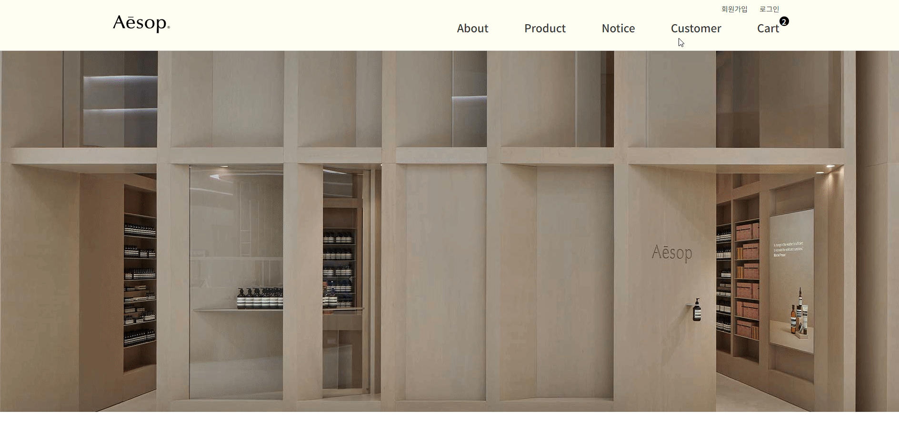
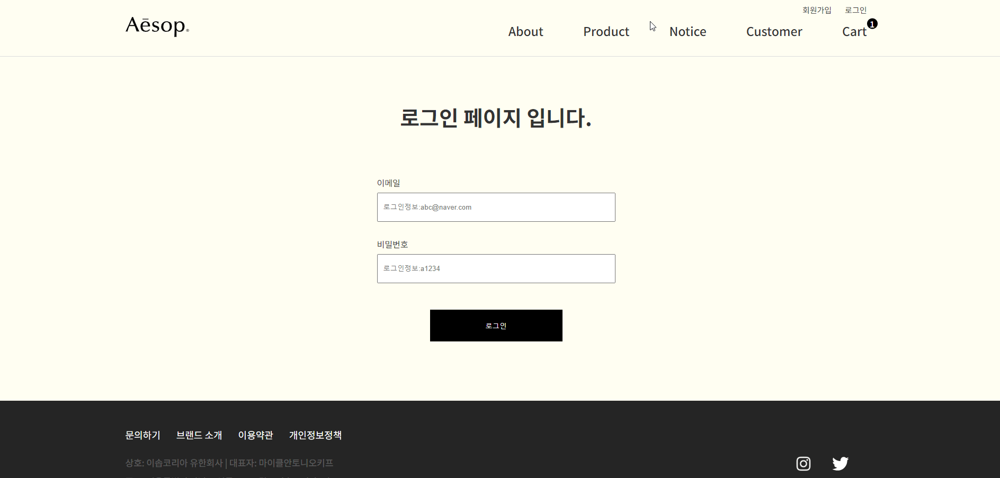

# 사이트 홈페이지 제작

 
 

# 프로젝트 참고 또는 리뉴얼 사이트

1. <a href="https://www.aesop.com/kr/" target="_blank">이솝공식사이트</a>

# 사용 기술  

- [X] React
- [X] Styled-Components
- [X] Axios 
- [X] Router 
- [X] Redux-toolkit

## 프로젝트 주요 기능
1. 상품 리스트
2. 장바구니
3. 로그인 / 로그아웃
4. 게시판 / 페이지네이션

## 프로젝트 작업 순서
1. 리뉴얼 웹 사이트 선정
2. 페이지 리뉴얼 및 디자인 수정
3. 기획, 요구사항 정리
4. 와이어프레임, 스토리보드 
5. React  / Styled-Components / Redux-toolkit

# 프로젝트 기능 구현

### 1) 메인

* swiper slide 배너 
* 리뉴얼 컨텐츠
  

### 2) 브랜드소개

* 리뉴얼 컨텐츠
  

### 3) 상품 리스트

* 상품 정렬
* 상품 정렬 초기화
* 상품 리스트 검색 기능 
* 주문하기 클릭 시 장바구니 담기
  

### 4) 장바구니

* 상품 증감 수량과 수량에 따른 각각의 가격 계산
* 체크박스 각각 클릭 시 전체 체크박스는 해제 (예정)
* 체크박스 클릭 시 수량, 총합 (예정)
* 선택상품 삭제
* 장바구니 전체 비우기
* 쇼핑하러가기 버튼 클릭 시 상품리스트로 이동
  

### 5) Notice 게시판 (공지사항)

* 페이지네이션
* 게시물 상세내용 확인가능, 다시 목록으로 이동
  

### 6) Customer 게시판 (고객문의)

* 글 작성 기능
* 글 수정 기능
* 글 삭제기능
* 페이지네이션
* 목록가기
* 글 작성 취소

### 7) 회원가입 / 로컬스토리지 저장

* 회원가입 시 로그인 가능

### 8) 로그인 / 로그아웃

* 로그인 시 헤더 로그아웃으로 변경 / 로그인 확인 페이지
  
